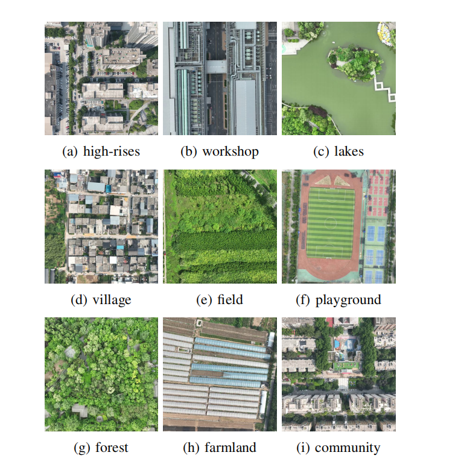

<h1 align="center"> SAVL: Scene-Adaptive UAV Visual Localization Using Sparse Feature Extraction and Incremental Descriptor Mapping </h1>


## 0. Table of Contents

* [Introduction](#1-introduction)

* [About Dataset](#2-about-dataset)

* [Example](#3. Example)

  

## 1. Introduction

The proposed RealUAV dataset aims to enhance pixel-level self-localization of drones and mitigate the limitations of visual localization in real-world scenarios. Unlike previous datasets that overlooked this aspect, RealUAV includes a series of images capturing drone flight trajectories. Additionally, it integrates orthorectified remote sensing imagery corresponding to each trajectory, covering a large geographic area, with each pixel precisely labeled with its corresponding coordinates.

## 2. About Dataset

You can download RealUAV  on [Google Drive](https://drive.google.com/file/d/1lLf2vs6OhOiA5KMhp3VYnm5dtUTOffam/view?usp=sharing) or [Baidu Net Disk](https://pan.baidu.com/s/13zgbP3Kjk1FDfZ47fBaC0g?pwd=rsai ).

The dataset is organized sequentially, with details on the number of localization instances and the flight distance for each sequence. Different sequences are tailored to various scenarios, with varying levels of localization difficulty. A total of 15 sequences are provided, covering 6,044 localization instances and a total flight distance of 24,063 meters.

The drone images are captured at a fixed flight altitude of 200 meters, with a global speed of 6 m/s and a video recording rate of 60 fps. Images are captured at intervals of 15 frames, each with a resolution of $490 \times 490$ pixels. The satellite images are sourced from Google Maps, with a zoom level of 19 and a pixel resolution of 0.247 m/pixel. These images are divided into $512 \times 512$ pixel blocks using a sliding window approach.

Representative scene display:



The dataset contents are as follows:

| Drone Images | Flight Path | Satellite Maps | Scene |
| ------------ | ----------- | -------------- | ------------- |
| 6,044        | 15          | 15             |7|


More detailed dataset structure：

```
├── RealUAV/
|	├── city1/                            /* flight sequence name
│      ├── crop/                          /* Satellite map slicing
│      │      ├── sat_image/
│      │      │      ├── 1112_1112.jpg    /*The coordinates of the center point in the large map
│      │      │      ├── 1112_1262.jpg
│      │      │      └── .../
│      │      └── sat_infos.csv           /* Recorded the coordinate information of the image
│      ├── mapbox.tif                     /* Satellite map containing flight paths
│      └── uav/
│          ├── start.txt                  /* The starting pixel coordinates of the drone on the satellite map
│          ├── uav_image_low_size/
│          │      ├── 001.jpg             /*UAV image
│          │      ├── 002.jpg
│          │      └── .../
│          └── uav_infos.csv             /*Contains latitude and longitude information of UAV imagese
|	├── city2/                            
...
...
...
|	├── village2/  
...
```

## 3. Example

Visual display in the village scene:

<video src="assets/demo.mp4"></video>

